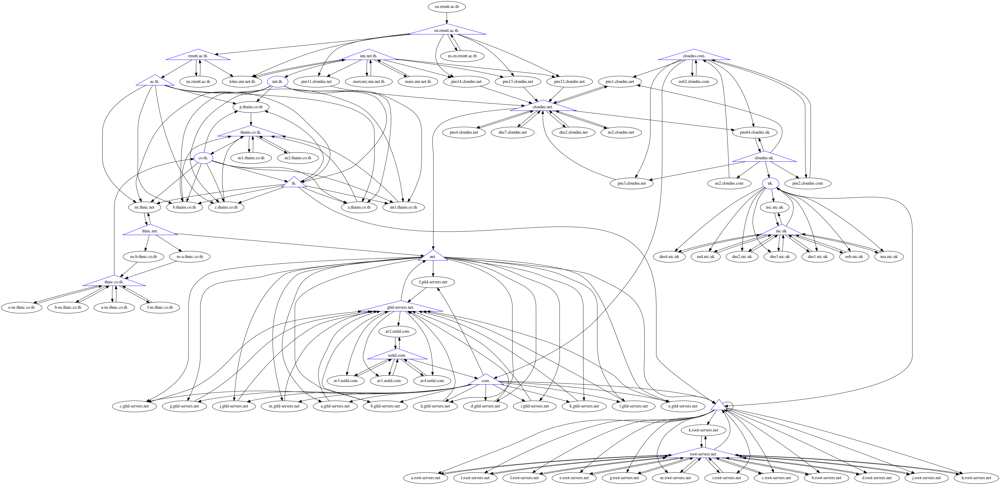
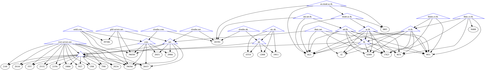

# share_dnsviz-report
---
- raw copy from *-plantuml.txt 
- paste in code box from render at [plantUML web](https://plantuml.ipv9.me)
---
- [Online dnsviz](https://dnsviz.net)
---
- DNSsec verify tools
-- [Verisign Labs](https://dnssec-analyzer.verisignlabs.com/)
-- [Transitive Trust Checker](https://trans-trust.verisignlabs.com/)
-- [DNSSEC DEBUGGER](https://dnssec-debugger.verisignlabs.com/)
---

